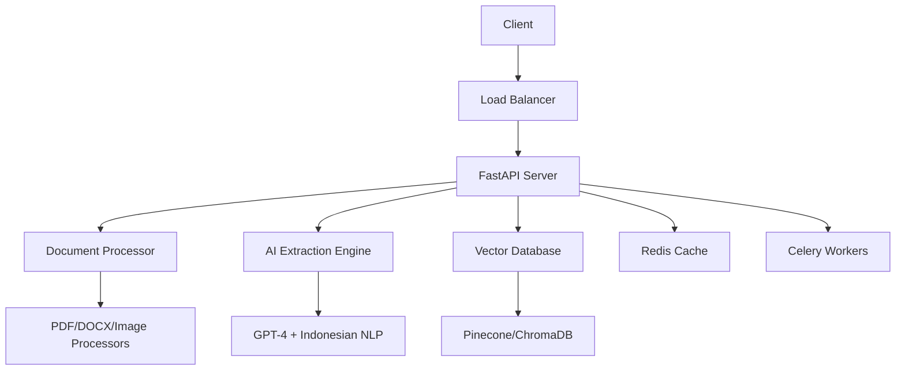

# 🚀 AI Document Processor

**Enterprise-grade AI document processing system optimized for Indonesian business documents.**

## 🌟 Features

### 📄 **Multi-Format Processing**
- **PDF Documents**: Text extraction + OCR for scanned documents
- **DOCX Files**: Native text and table extraction
- **Images**: Indonesian OCR with PaddleOCR + Tesseract
- **Email Attachments**: Automated detection and processing

### 🧠 **AI-Powered Extraction**
- **GPT-4 Integration**: Advanced entity extraction and classification
- **Indonesian Optimization**: Bahasa Indonesia language models
- **Business Context**: KTP, NPWP, Indonesian phone numbers, addresses
- **Smart Classification**: Contracts, invoices, reports, legal documents

### 🔍 **Semantic Search**
- **Vector Database**: Pinecone + ChromaDB integration
- **Natural Language Queries**: Search in Indonesian and English
- **Document Similarity**: Find related documents automatically
- **Advanced Filtering**: By type, date, content, metadata

### 🏢 **Enterprise Ready**
- **Authentication**: JWT-based security with role management
- **Rate Limiting**: Configurable limits per user/plan
- **Monitoring**: Prometheus metrics + health checks
- **Scaling**: Kubernetes deployment with auto-scaling
- **Background Processing**: Celery for large document handling

---

## 🚀 Quick Start

### 1️⃣ **Installation**

```bash
# Clone repository
git clone https://github.com/yourusername/ai-doc-indo.git
cd ai-doc-indo

# Run setup script
chmod +x setup.sh
./setup.sh

# Activate virtual environment
source venv/bin/activate
```

### 2️⃣ **Configuration**

```bash
# Copy environment template
cp .env.example .env

# Edit configuration (add your API keys)
nano .env
```

**Required API Keys:**
- `OPENAI_API_KEY`: Get from [OpenAI Platform](https://platform.openai.com/api-keys)
- `PINECONE_API_KEY`: Get from [Pinecone Console](https://app.pinecone.io/)

### 3️⃣ **Start Development Server**

```bash
# Start all services
./start_development.sh

# Or start manually:
redis-server --daemonize yes
celery -A main.celery_app worker --loglevel=info &
uvicorn main:app --reload
```

### 4️⃣ **Test API**

```bash
# Health check
curl http://localhost:8000/health

# Get authentication token
curl -X POST "http://localhost:8000/auth/token" \
  -d "email=admin@company.com&password=secret"

# Process document
curl -X POST "http://localhost:8000/process-document" \
  -H "Authorization: Bearer YOUR_TOKEN" \
  -F "file=@sample.pdf"
```

**🎉 Ready! API available at:** http://localhost:8000/docs

---

## 📋 API Endpoints

### **Authentication**
- `POST /auth/token` - Get JWT authentication token
- `GET /user/profile` - Get user profile and usage statistics

### **Document Processing**
- `POST /process-document` - Process document with AI extraction
- `POST /process-document-async` - Background processing for large files
- `GET /job/{job_id}` - Check async processing job status

### **Search & Retrieval**
- `POST /search` - Semantic document search
- `GET /documents` - List processed documents
- `GET /documents/{doc_id}` - Get specific document details

### **System**
- `GET /health` - Health check endpoint
- `GET /metrics` - Prometheus metrics
- `GET /docs` - Interactive API documentation

---

## 🏗️ Architecture



### **Key Components:**
- **FastAPI**: Modern web framework with automatic API docs
- **Celery + Redis**: Background task processing and caching
- **GPT-4**: Advanced AI for extraction and classification
- **PaddleOCR**: Indonesian language OCR processing
- **Pinecone**: Production vector database for semantic search
- **Kubernetes**: Container orchestration for scaling

---

## 🇮🇩 Indonesian Optimization

### **Language Support**
- **OCR Models**: PaddleOCR with Indonesian language pack
- **NLP Processing**: Indonesian BERT models (IndoBERT)
- **Spacy Models**: Multilingual entity recognition
- **Custom Patterns**: Regex for Indonesian formats

### **Business Context**
- **KTP Numbers**: 16-digit Indonesian ID card extraction
- **NPWP**: Tax identification number processing
- **Phone Numbers**: Indonesian mobile and landline formats
- **Addresses**: Indonesian address parsing and validation
- **Currency**: Rupiah amount extraction and formatting

### **Document Types**
- **Faktur Pajak**: Indonesian tax invoice processing
- **Kontrak Kerja**: Employment contract analysis
- **Surat Kuasa**: Power of attorney documents
- **Laporan Keuangan**: Financial report extraction

---

## 🐳 Deployment

### **Development**
```bash
./start_development.sh
```

### **Production (Docker)**
```bash
docker-compose up -d
```

### **Kubernetes**
```bash
kubectl apply -f k8s/
```

### **Cloud Deployment**
- **AWS**: EKS cluster with ALB ingress
- **Google Cloud**: GKE with Cloud Load Balancer  
- **Azure**: AKS with Application Gateway

---

## 📊 Performance

### **Processing Speed**
- **Small Documents** (< 5 pages): 2-5 seconds
- **Medium Documents** (5-20 pages): 10-30 seconds
- **Large Documents** (20+ pages): 1-5 minutes (background)

### **Accuracy Rates**
- **Text Extraction**: 98%+ for digital documents
- **OCR Processing**: 85-95% for scanned documents
- **Entity Extraction**: 90-95% with GPT-4
- **Classification**: 95%+ for common document types

### **Scalability**
- **Concurrent Users**: 1000+ with proper scaling
- **Documents/Hour**: 10,000+ with background processing
- **Storage**: Unlimited with cloud storage integration
- **API Calls**: Rate limited by plan (100-2000/hour)

---

## 🧪 Testing

```bash
# Run all tests
pytest

# Run specific test categories
pytest tests/test_api.py
pytest tests/test_processors.py
pytest tests/test_extractors.py

# Run with coverage
pytest --cov=api tests/
```

---

## 🤝 Contributing

1. Fork the repository
2. Create feature branch (`git checkout -b feature/amazing-feature`)
3. Commit changes (`git commit -m 'Add amazing feature'`)
4. Push to branch (`git push origin feature/amazing-feature`)
5. Open Pull Request


## 🙋‍♂️ Support

### **Documentation**
- [API Documentation](docs/API.md)
- [Setup Guide](docs/SETUP.md)
- [Deployment Guide](docs/DEPLOYMENT.md)
- [Architecture Overview](docs/ARCHITECTURE.md)

### **Enterprise Support**
For enterprise support, custom development, and consulting services:
- **Email**: kwarsarajab@gmail.com.com

## 🏆 Acknowledgments

- **OpenAI** for GPT-4 API
- **Pinecone** for vector database
- **PaddleOCR** for Indonesian OCR
- **FastAPI** for the amazing web framework
- **Indonesian AI Community** for local insights


**🚀 Transform your document processing today!**
